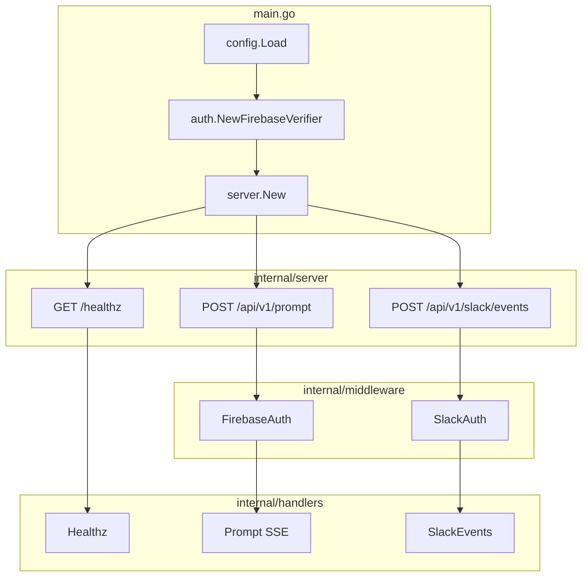

# Architecture

## Overview

ai-orchestrator is a standalone Go HTTP service. It does not call Care Portal or act. Authentication proves caller identity; authorization (Reema `iam.*` / `CAN_*`) is deferred to downstream services.



## Request flows

### Web app — `POST /api/v1/prompt`

1. Client sends `Authorization: Bearer <firebase-id-token>` and optional `{"prompt":"..."}`.
2. `FirebaseAuth` middleware calls `auth.ExtractBearerToken` then `FirebaseVerifier.VerifyToken`.
3. On success, `auth.Principal{ReemaUserID}` is stored on `r.Context()`.
4. `handlers.Prompt` reads the principal, optionally decodes the prompt body, opens an SSE stream.
5. Stream emits a `meta` event with `reemaUserId`, then five skeleton token chunks (500ms apart).

### Slack — `POST /api/v1/slack/events`

1. Slack sends raw JSON body + `X-Slack-Signature` + `X-Slack-Request-Timestamp`.
2. `SlackAuth` reads the raw body, calls `auth.VerifySlackRequest`, stores body on context via `auth.WithSlackBody`.
3. `handlers.SlackEvents` parses JSON by `type`:
   - `url_verification` → return `{"challenge":"..."}`
   - `event_callback` → return `{"status":"accepted"}`, `go processSlackEvent(...)` in background
   - default → `{"status":"accepted"}`

## Package reference

### `main.go`

| Responsibility |
|----------------|
| Load config from environment / `.env` |
| Construct `FirebaseVerifier` (fetches Google JWKS at startup) |
| Start `server.Server` on `cfg.Port` |
| Block on SIGINT/SIGTERM |

### `internal/config`

| File | Symbols | Purpose |
|------|---------|---------|
| `config.go` | `Config`, `Load()` | Reads env vars; loads `.env` via godotenv (non-fatal if missing) |

**Required env vars:** `FIREBASE_PROJECT_ID`, `SLACK_SIGNING_SECRET`  
**Optional:** `PORT` (default `8080`), `FIREBASE_SIGN_IN_PROVIDER` (default `google.com`)

`godotenv.Load()` does not override variables already set in the shell.

### `internal/auth`

Cryptographic verification and request-scoped identity. No HTTP types in the core verify functions (except context helpers).

| File | Key symbols | Purpose |
|------|-------------|---------|
| `errors.go` | `ErrNoCredentials`, `ErrVerificationFailed` | Typed errors mapped to 401 / 403 by middleware |
| `context.go` | `Principal`, `WithPrincipal`, `PrincipalFromContext`, `WithSlackBody`, `SlackBodyFromContext` | Attach verified identity / Slack payload to `context.Context` |
| `firebase.go` | `FirebaseVerifier`, `NewFirebaseVerifier`, `ExtractBearerToken`, `VerifyToken` | JWT verify against Firebase JWKS |
| `slack.go` | `VerifySlackRequest`, `SignSlackRequest`, `VerifySlackRequestWithNow` | Slack HMAC verify (+ test helper with fixed clock) |

#### Firebase verification (`VerifyToken`)

1. Parse JWT, verify RS256 signature via JWKS (`https://www.googleapis.com/service_accounts/v1/jwk/securetoken@system.gserviceaccount.com`).
2. Validate `iss` = `https://securetoken.google.com/<FIREBASE_PROJECT_ID>`.
3. Validate `aud` contains `<FIREBASE_PROJECT_ID>`.
4. Reject expired tokens (`exp`).
5. Require `firebase.sign_in_provider` = configured provider (default `google.com`).
6. Require `reemaUserId` claim as a valid UUID.

#### Slack verification (`VerifySlackRequest`)

1. Require non-empty `X-Slack-Signature` and `X-Slack-Request-Timestamp`.
2. Reject timestamps outside a 5-minute window (replay protection).
3. Compute `HMAC-SHA256(signing_secret, "v0:" + timestamp + ":" + raw_body)`.
4. Compare to header with `subtle.ConstantTimeCompare`.

### `internal/middleware`

Thin HTTP layer over `internal/auth`.

| File | Key symbols | Purpose |
|------|-------------|---------|
| `auth.go` | `FirebaseAuth`, `SlackAuth`, `WriteAuthError`, `FirebaseVerifier` (interface) | Middleware chains; maps auth errors to HTTP status |

| Auth error | HTTP status | Body |
|------------|-------------|------|
| `ErrNoCredentials` | 401 | `Unauthorized` |
| `ErrVerificationFailed` (and other) | 403 | `Forbidden` |

`FirebaseVerifier` interface allows stubbing in middleware tests without live JWKS.

### `internal/handlers`

| File | Handler | Purpose |
|------|---------|---------|
| `healthz.go` | `Healthz` | GCP liveness — `GET` only, `{"status":"healthy"}` |
| `prompt.go` | `Prompt`, `StreamPromptForTest` | SSE prompt stream; test helper with configurable chunk delay |
| `slack.go` | `SlackEvents` | Slack URL verification + event ack + async stub processor |

`processSlackEvent` (unexported) logs events today. TODO: Slack user → `reemaUserId` mapping, ADK agent dispatch.

### `internal/server`

| File | Key symbols | Purpose |
|------|-------------|---------|
| `server.go` | `Server`, `New`, `Handler`, `ListenAndServe` | Registers routes on `http.ServeMux` (Go 1.22+ method+path patterns) |

```go
GET  /healthz              → handlers.Healthz (no auth)
POST /api/v1/prompt        → FirebaseAuth → handlers.Prompt
POST /api/v1/slack/events  → SlackAuth    → handlers.SlackEvents
```

## Security model

| Layer | What it proves | What it does not prove |
|-------|----------------|------------------------|
| Firebase JWT | Specific Reema user (`reemaUserId`) | Permission to use Lasso features |
| Slack HMAC | Request came from someone with the signing secret (intended: Slack) | Which Reema user the event belongs to |

**Never trust:** `X-User-Id`, `reemaUserId`, or `email` from JSON body or custom headers without verified JWT.

## Deployment

| Artifact | Notes |
|----------|-------|
| `Dockerfile` | Multi-stage build; exposes 8080; `go mod download` cached layer |
| `docker-compose.yml` | Builds image, maps 8080, loads `env_file: .env` |

Cloud Run: inject env vars / Secret Manager; no `.env` file in the image.

## Not yet implemented

- ADK/VDS agent orchestration (skeleton SSE chunks only)
- Slack `slack_user_id` + `team_id` → `reemaUserId` mapping
- Reema IAM / `CAN_*` permission checks
- Request body size limits, rate limiting, structured audit logs
