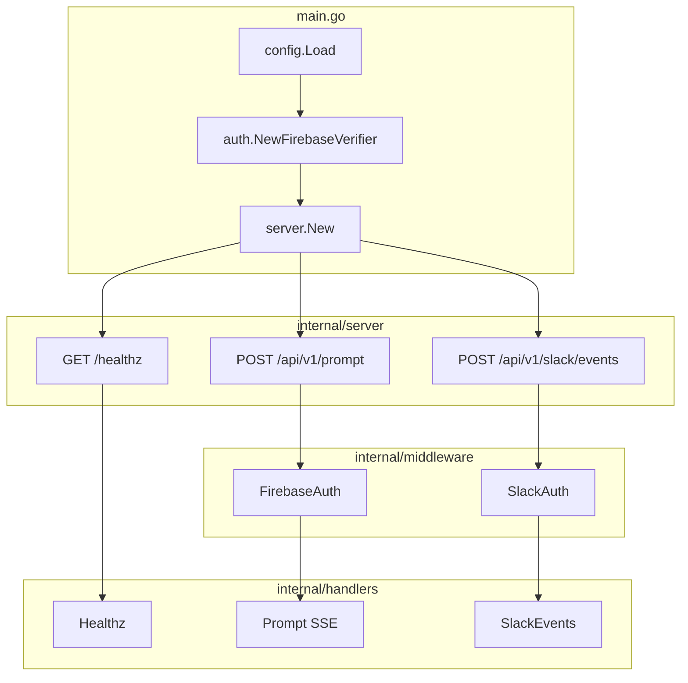
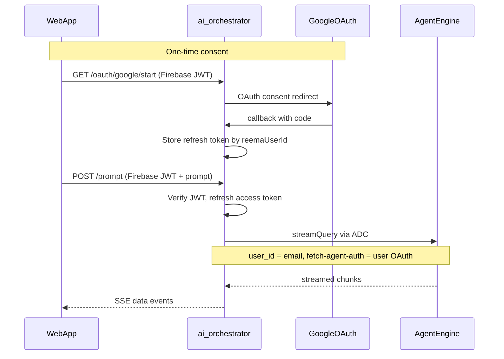

# Architecture

## Overview

ai-orchestrator is a standalone Go HTTP service. It does not call Care Portal or act. Authentication proves caller identity; authorization (Reema `iam.*` / `CAN_*`) is deferred to downstream services.


```mermaid
flowchart TD
    subgraph entry [main.go]
        Load[config.Load]
        FB[auth.NewFirebaseVerifier]
        Srv[server.New]
    end

    subgraph routes [internal/server]
        Healthz["GET /healthz"]
        Prompt["POST /api/v1/prompt"]
        Slack["POST /api/v1/slack/events"]
    end

    subgraph authLayer [internal/middleware]
        FMW[FirebaseAuth]
        SMW[SlackAuth]
    end

    subgraph handlers [internal/handlers]
        H[Healthz]
        P[Prompt SSE]
        SE[SlackEvents]
    end

    Load --> FB --> Srv
    Srv --> Healthz --> H
    Srv --> Prompt --> FMW --> P
    Srv --> Slack --> SMW --> SE
```

## Request flows

### Web app — `POST /api/v1/prompt`

1. Client sends `Authorization: Bearer <firebase-id-token>` and `{"prompt":"..."}`.
2. `FirebaseAuth` middleware calls `auth.ExtractBearerToken` then `FirebaseVerifier.VerifyToken`.
3. On success, `auth.Principal{ReemaUserID, Email}` is stored on `r.Context()`.
4. `PromptHandler` requires non-empty `prompt` (400 otherwise).
5. `useroauth.TokenProvider` resolves a user-scoped Google access token: client override (`X-GCP-Access-Token`) wins; otherwise refresh stored grant; returns 428 if consent required.
6. Opens SSE stream: `meta` event with `reemaUserId`, then agent chunks.
7. `agent.Client.StreamQuery` calls Vertex Reasoning Engine `:streamQuery` via ADC when `AGENT_ENABLED=true`, or `SkeletonClient` locally when false.
8. Verified `email` is sent as Agent Engine `user_id` (ADK session + enterprise ACL key).
9. User OAuth access token is passed in session `state` and query `state_delta` under `AGENT_GE_AUTH_STATE_KEY` for workspace datastore access.


```mermaid
sequenceDiagram
    participant Client as WebApp
    participant Orch as ai_orchestrator
    participant Google as GoogleOAuth
    participant Vertex as AgentEngine

    Note over Client,Google: One-time consent
    Client->>Orch: GET /oauth/google/start (Firebase JWT)
    Orch->>Google: OAuth consent redirect
    Google->>Orch: callback with code
    Orch->>Orch: Store refresh token by reemaUserId

    Client->>Orch: POST /prompt (Firebase JWT + prompt)
    Orch->>Orch: Verify JWT, refresh access token
    Orch->>Vertex: streamQuery via ADC
    Note over Orch,Vertex: user_id = email, fetch-agent-auth = user OAuth
    Vertex-->>Orch: streamed chunks
    Orch-->>Client: SSE data events
```

### Slack — `POST /api/v1/slack/events`

1. Slack sends raw JSON body + `X-Slack-Signature` + `X-Slack-Request-Timestamp`.
2. `SlackAuth` reads the raw body, calls `auth.VerifySlackRequest`, stores body on context via `auth.WithSlackBody`.
3. `handlers.SlackEvents` parses JSON by `type`:
   - `url_verification` → return `{"challenge":"..."}`
   - `event_callback` → return `{"status":"accepted"}`, `go processSlackEvent(...)` in background
   - default → `{"status":"accepted"}`

## Package reference

### `main.go`

| Responsibility |
|----------------|
| Load config from environment / `.env` |
| Construct `FirebaseVerifier` (fetches Google JWKS at startup) |
| Build `agent.Client` (Vertex or skeleton based on `AGENT_ENABLED`) |
| Build `useroauth.TokenProvider` and `GoogleOAuthHandler` with in-memory refresh store |
| Start `server.Server` on `cfg.Port` |
| Block on SIGINT/SIGTERM |

### `internal/config`

| File | Symbols | Purpose |
|------|---------|---------|
| `config.go` | `Config`, `Load()` | Reads env vars; loads `.env` via godotenv (non-fatal if missing) |

**Required env vars:** `FIREBASE_PROJECT_ID`, `SLACK_SIGNING_SECRET`  
**Optional:** `PORT` (default `8080`), `FIREBASE_SIGN_IN_PROVIDER` (default `google.com`)  
**Vertex (when `AGENT_ENABLED=true`):** `GCP_PROJECT`, `GCP_LOCATION`, `REASONING_ENGINE_ID`, optional `AGENT_CLASS_METHOD` (default `async_stream_query`)  
**User OAuth (optional):** `GOOGLE_OAUTH_CLIENT_ID`, `GOOGLE_OAUTH_CLIENT_SECRET`, `GOOGLE_OAUTH_REDIRECT_URI`, optional `USER_OAUTH_MODE`, `GOOGLE_OAUTH_SCOPES`

`godotenv.Load()` does not override variables already set in the shell.

### `internal/auth`

Cryptographic verification and request-scoped identity. No HTTP types in the core verify functions (except context helpers).

| File | Key symbols | Purpose |
|------|-------------|---------|
| `errors.go` | `ErrNoCredentials`, `ErrVerificationFailed` | Typed errors mapped to 401 / 403 by middleware |
| `context.go` | `Principal`, `WithPrincipal`, `PrincipalFromContext`, `WithSlackBody`, `SlackBodyFromContext` | Attach verified identity / Slack payload to `context.Context` |
| `firebase.go` | `FirebaseVerifier`, `NewFirebaseVerifier`, `ExtractBearerToken`, `VerifyToken` | JWT verify against Firebase JWKS |
| `slack.go` | `VerifySlackRequest`, `SignSlackRequest`, `VerifySlackRequestWithNow` | Slack HMAC verify (+ test helper with fixed clock) |

#### Firebase verification (`VerifyToken`)

1. Parse JWT, verify RS256 signature via JWKS (`https://www.googleapis.com/service_accounts/v1/jwk/securetoken@system.gserviceaccount.com`).
2. Validate `iss` = `https://securetoken.google.com/<FIREBASE_PROJECT_ID>`.
3. Validate `aud` contains `<FIREBASE_PROJECT_ID>`.
4. Reject expired tokens (`exp`).
5. Require `firebase.sign_in_provider` = configured provider (default `google.com`).
6. Require `reemaUserId` claim as a valid UUID.
7. Require `email` claim when sign-in provider is `google.com`.

#### Slack verification (`VerifySlackRequest`)

1. Require non-empty `X-Slack-Signature` and `X-Slack-Request-Timestamp`.
2. Reject timestamps outside a 5-minute window (replay protection).
3. Compute `HMAC-SHA256(signing_secret, "v0:" + timestamp + ":" + raw_body)`.
4. Compare to header with `subtle.ConstantTimeCompare`.

### `internal/middleware`

Thin HTTP layer over `internal/auth`.

| File | Key symbols | Purpose |
|------|-------------|---------|
| `auth.go` | `FirebaseAuth`, `SlackAuth`, `WriteAuthError`, `FirebaseVerifier` (interface) | Middleware chains; maps auth errors to HTTP status |

| Auth error | HTTP status | Body |
|------------|-------------|------|
| `ErrNoCredentials` | 401 | `Unauthorized` |
| `ErrVerificationFailed` (and other) | 403 | `Forbidden` |

`FirebaseVerifier` interface allows stubbing in middleware tests without live JWKS.

### `internal/agent`

Vertex AI Reasoning Engine client and local skeleton for development.

| File | Key symbols | Purpose |
|------|-------------|---------|
| `client.go` | `Client`, `StreamQueryInput` | Interface for streaming agent output |
| `vertex.go` | `VertexClient`, `NewVertexClient` | `:streamQuery` via ADC; parses streamed JSON chunks |
| `skeleton.go` | `SkeletonClient`, `NewSkeletonClient` | Five placeholder chunks when `AGENT_ENABLED=false` |

Orchestrator → Vertex auth uses **Application Default Credentials** (Cloud Run service account locally via `gcloud auth application-default login`). User identity for enterprise ACLs is passed as verified **email** in the agent input `user_id` field — not the raw Firebase JWT. User-scoped workspace search uses a separate **Google OAuth access token** resolved by `internal/useroauth`.

### `internal/useroauth`

User-scoped Google OAuth for workspace datastore ACLs.

| File / package | Key symbols | Purpose |
|----------------|-------------|---------|
| `provider.go` | `TokenProvider`, `NewProvider`, `ErrConsentRequired` | Resolve access tokens from stored refresh grants or client override |
| `state.go` | `StateCodec` | HMAC-signed OAuth state binding consent to `reemaUserId` |
| `store/` | `RefreshTokenStore`, `MemoryStore` | Persist refresh tokens (in-memory today; encrypted persistent store for prod) |

Trust boundary: refresh tokens are keyed by verified `reemaUserId` from Firebase JWT — never from request body. Optional `GOOGLE_OAUTH_ALLOWED_DOMAINS` restricts which verified emails may receive tokens.

### `internal/handlers`

| File | Handler | Purpose |
|------|---------|---------|
| `healthz.go` | `Healthz` | GCP liveness — `GET` only, `{"status":"healthy"}` |
| `prompt.go` | `PromptHandler`, `NewPromptHandler`, `StreamPromptForTest` | SSE prompt stream via `agent.Client` + `useroauth.TokenProvider` |
| `google_oauth.go` | `GoogleOAuthHandler` | Google OAuth start, callback, revoke |
| `slack.go` | `SlackEvents` | Slack URL verification + event ack + async stub processor |

`processSlackEvent` (unexported) logs events today. TODO: Slack user → `reemaUserId` mapping, ADK agent dispatch.

### `internal/server`

| File | Key symbols | Purpose |
|------|-------------|---------|
| `server.go` | `Server`, `New`, `Handler`, `ListenAndServe` | Registers routes on `http.ServeMux` (Go 1.22+ method+path patterns) |

```go
GET  /healthz                        → handlers.Healthz (no auth)
POST /api/v1/prompt                  → FirebaseAuth → PromptHandler
GET  /api/v1/oauth/google/start      → FirebaseAuth → GoogleOAuthHandler.Start
GET  /api/v1/oauth/google/callback   → GoogleOAuthHandler.Callback (signed state)
DELETE /api/v1/oauth/google/revoke   → FirebaseAuth → GoogleOAuthHandler.Revoke
POST /api/v1/slack/events            → SlackAuth    → handlers.SlackEvents
```

## Security model

| Layer | What it proves | What it does not prove |
|-------|----------------|------------------------|
| Firebase JWT | Specific Reema user (`reemaUserId`, `email`) | Permission to use Lasso features |
| Google OAuth refresh grant | User consented to workspace API scopes for orchestrator | Permission to use Lasso features |
| Slack HMAC | Request came from someone with the signing secret (intended: Slack) | Which Reema user the event belongs to |

**Never trust:** `X-User-Id`, `reemaUserId`, or `email` from JSON body or custom headers without verified JWT. Never trust `X-GCP-Access-Token` for identity — only as an optional credential override when explicitly sent by the client.

## Deployment

| Artifact | Notes |
|----------|-------|
| `Dockerfile` | Multi-stage build; exposes 8080; `go mod download` cached layer |
| `docker-compose.yml` | Builds image, maps 8080, loads `env_file: .env` |

Cloud Run: inject env vars / Secret Manager; no `.env` file in the image.

## Not yet implemented

- Slack `slack_user_id` + `team_id` → `reemaUserId` mapping
- Reema IAM / `CAN_*` permission checks
- Forwarding Firebase JWT to Vertex (intentionally not done)
- Encrypted persistent refresh token store (Firestore / Secret Manager) for production
- Domain-wide delegation fallback (`USER_OAUTH_MODE=dwd`)
